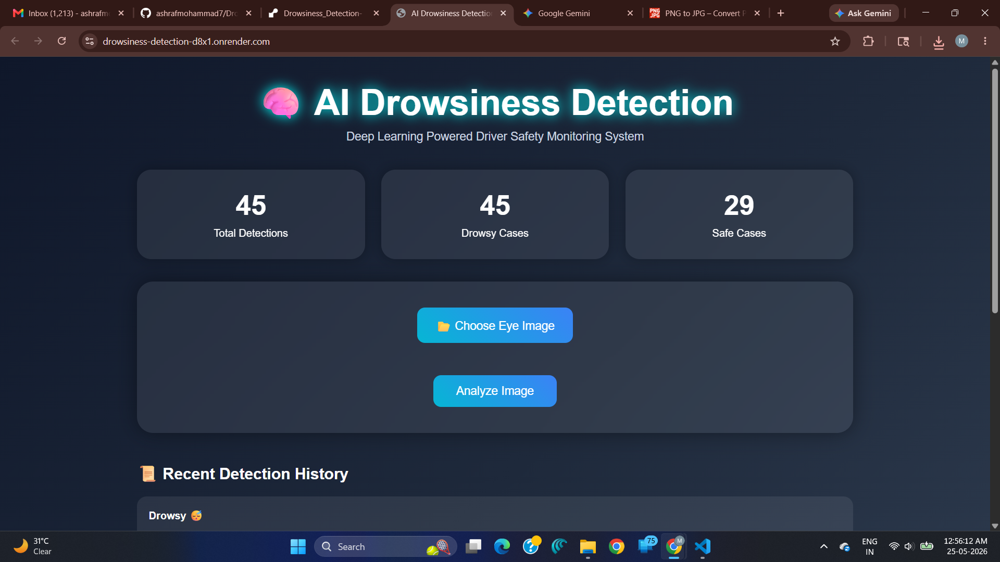
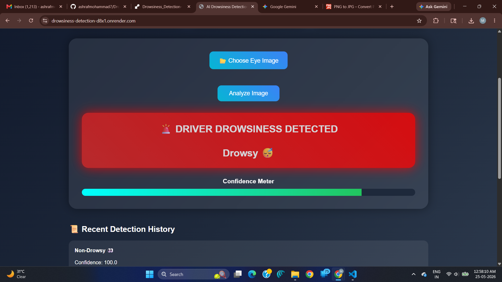
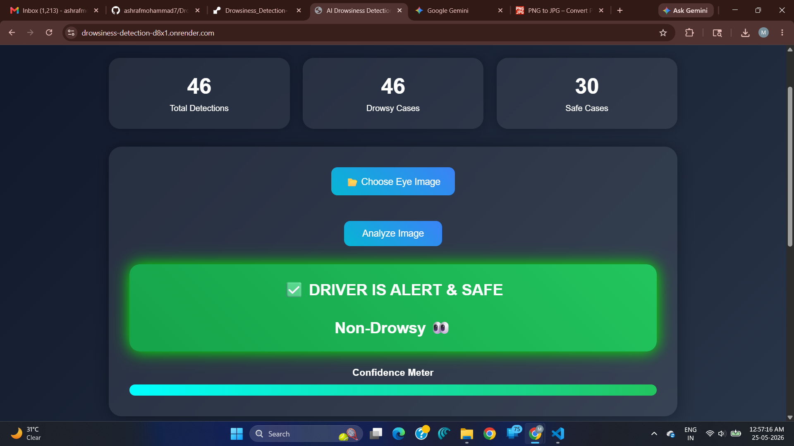
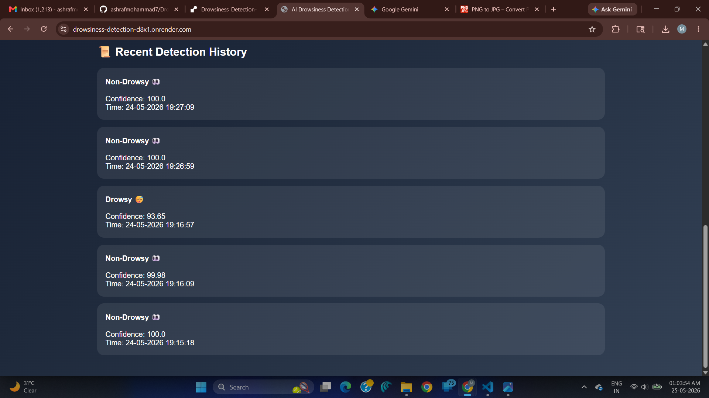
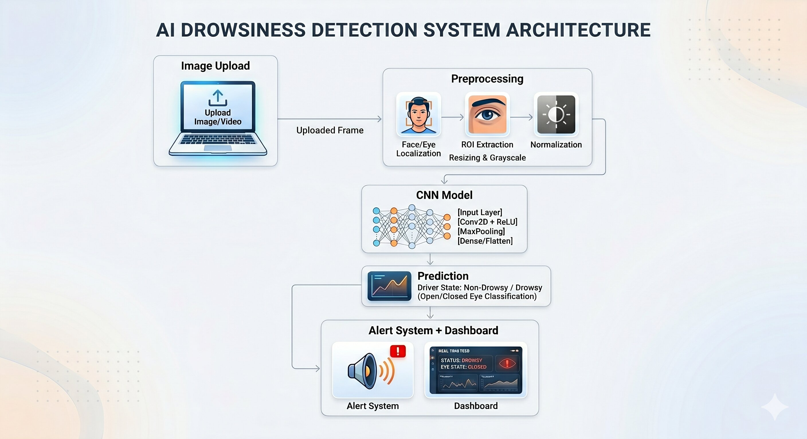

# 💤 AI Drowsiness Detection System


A Deep Learning powered web application that detects whether a driver is **Drowsy** or **Non-Drowsy** using eye images.  
The system uses a Convolutional Neural Network (CNN) trained on eye-state images and provides real-time prediction results with confidence scores, alert notifications, and detection history tracking.

---

# 🚀 Live Demo

🌐 https://drowsiness-detection-d8x1.onrender.com

---

# 📌 Features

✅ AI-based Drowsiness Detection  
✅ Eye Image Upload & Prediction  
✅ Deep Learning Model using TensorFlow/Keras  
✅ Real-Time Confidence Meter  
✅ Alert & Warning System  
✅ Detection History Tracking  
✅ Statistics Dashboard  
✅ Responsive Modern UI  
✅ Flask Backend Integration  
✅ Render Cloud Deployment  

---

# 🧠 Tech Stack

## Frontend
- HTML5
- CSS3
- JavaScript

## Backend
- Flask (Python)

## AI / Machine Learning
- TensorFlow
- Keras
- OpenCV
- NumPy

## Deployment
- Render

# 🎯 Project Objective

The objective of this project is to reduce road accidents caused by driver fatigue using AI-powered eye-state analysis and deep learning techniques.

---

# 📸 Screenshots

## 📊 Application Dashboard



---

## 😴 Drowsiness Detection Alert



---

## ✅ Non-Drowsy Detection



---

## 📈 Detection History & Analytics



---

# 🧠 System Architecture


---

# ⚙️ Working Process

1. User uploads an eye image.
2. Image is preprocessed using OpenCV.
3. The CNN model analyzes the eye state.
4. System predicts:
   - Drowsy 😴
   - Non-Drowsy 👀
5. Confidence score is displayed.
6. Detection history is stored.
7. Alert system activates for drowsy state.

---

# 🧠 Deep Learning Model

The project uses a Convolutional Neural Network (CNN) trained on eye-state image datasets.

## Model Workflow
- Image Resizing
- Normalization
- CNN Feature Extraction
- Classification Layer
- Prediction Output

---

# 📂 Project Structure

```bash
Drowsiness_Detection/
│
├── app.py
├── train.py
├── prepare_dataset.py
├── eye_model.h5
├── detection_history.json
├── requirements.txt
├── runtime.txt
├── Procfile
├── render.yaml
│
├── templates/
│   └── index.html
│
├── static/
│   ├── uploads/
│   └── alarm.mp3
│
└── README.md
```

---

# ⚙️ Installation & Setup

## Clone Repository

```bash
git clone https://github.com/ashrafmohammad7/Drowsiness_Detection-.git
```

## Navigate to Project

```bash
cd Drowsiness_Detection-
```

## Install Dependencies

```bash
pip install -r requirements.txt
```

## Run Application

```bash
python app.py
```

---

# 🧠 Model Training

To retrain the CNN model:

```bash
python train.py
```

---

# 📚 Dataset Information

The model is trained using eye-state image datasets containing:
- Open Eye Images
- Closed Eye Images

The dataset is preprocessed using OpenCV before training.

---

# 🌐 Deployment

This project is deployed on **Render Cloud Platform**.

---

# 📈 Model Performance

- Training Accuracy: ~95%
- Validation Accuracy: ~93%
- Binary Classification:
  - Open Eye → Non-Drowsy
  - Closed Eye → Drowsy

# 📈 Future Improvements

- Live Webcam Detection
- Real-Time Video Stream Monitoring
- Mobile Application Integration
- Driver Monitoring System
- Email/SMS Alert System
- Advanced CNN Architecture
- Real-Time Face Detection

---

# 👨‍💻 Author

## Ashraf Mohammad

GitHub:  
https://github.com/ashrafmohammad7
